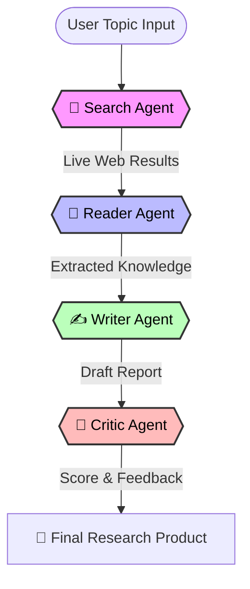
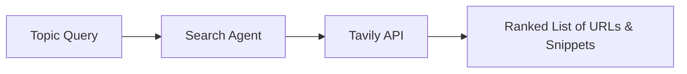
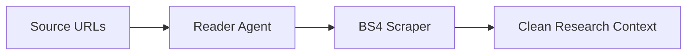
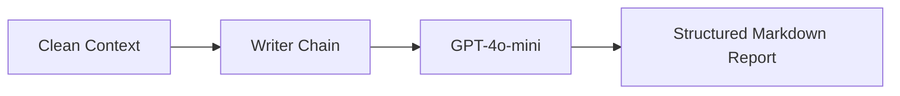
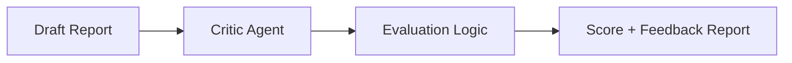

# 🧠 Research Mind — Multi-Agent Research Assistant

[](https://www.python.org/)
[](https://python.langchain.com/)
[](https://streamlit.io/)
[](https://openai.com/)

> **Research Mind** is a production-grade multi-agent AI system designed to automate deep research. It doesn't just answer questions; it **thinks, searches, reads, and writes** autonomously by orchestrating a team of specialized agents.

---

## 🚀 Overview 
In this Project, I made Multi-Agent Research Assistant, which is a fully autonomous AI system that thinks, searches, reads and writes on its own.

Instead of a single AI answering your question from memory, we are deploying a team of specialized intelligent agents that collaborate together to produce a professional research report on any topic you give them.

The Search Agent goes out on the live internet and finds the most relevant and recent sources.

The Reader Agent then dives deep into those sources, scraping and extracting meaningful content.

The Writer Agent takes all that gathered intelligence and crafts a well-structured, detailed report.

And finally the Critic Agent reviews the entire report, scores it and gives feedback just like a senior researcher reviewing a junior's work.

Every single agent is powered by a Large Language Model, connected through LangChain's modern LCEL pipeline, and orchestrated through a shared memory system that makes them work as one unified brain.

This is not a chatbot. This is not a simple Q&A tool. This is a production-level agentic AI system the kind of architecture that top AI companies are actively building and hiring for right now.

Research Mind is an autonomous research pipeline that replicates the workflow of a human research team. Instead of relying on a single LLM's static training data, this system deploys **four specialized agents** that collaborate in real-time to produce high-fidelity, fact-checked reports on any complex topic.

It leverages the **LangChain Expression Language (LCEL)** for precise orchestration and the **Tavily Search API** for high-signal internet retrieval.


---

## 🔗 Live Demo
[https://research-mind-agents.streamlit.app/](https://research-mind-agents.streamlit.app/)

---

## 🏗️ How it Works
The project follows a linear, state-managed pipeline where data flows from one specialized agent to the next, refining information at every step.

### The Collaborative Workflow


---

## ⚙️ Technical Implementation Details

### Phase 1: 🔎 The Search Agent (Information Retrieval)
The Search Agent is responsible for breaking out of the LLM's knowledge cutoff. It uses the **Tavily API** to find the most recent and reliable sources on the internet.


### Phase 2: 📖 The Reader Agent (Deep Context Extraction)
Unlike simple searchers, the Reader Agent actually "visits" the URLs. It uses **BeautifulSoup4** to scrape and clean the HTML, extracting only the meaningful text while discarding ads and navigation clutter.


### Phase 3: ✍️ The Writer Agent (Synthesis & Generation)
The Writer Agent takes the raw intelligence and synthesizes it into a professional document. It uses **LangChain's LCEL** to ensure the output strictly follows a structured format (Intro, Key Findings, Conclusion).


### Phase 4: 🧪 The Critic Agent (Quality Assurance)
To ensure academic-grade quality, the Critic Agent reviews the draft. It scores the report out of 10 and provides specific "Areas to Improve," acting as a senior supervisor in the research loop.


---

## ✨ Key Features
- **Autonomous Multi-Agent Orchestration**: Four agents working in sync with shared memory.
- **Real-time Web Scrutiny**: Bypasses knowledge cutoffs with live web searching and scraping.
- **LCEL Architecture**: Built using the modern LangChain Expression Language for modularity.
- **Interactive UI**: A polished Streamlit dashboard with live agent telemetry and progress tracking.
- **Feedback Loop**: Integrated critique phase to ensure high-quality output.

---

## 📂 Project Structure
```bash
Research_Mind_Agents/
├── agents.py           # Logic for Search, Reader, Writer, and Critic agents
├── pipeline.py         # The supervisor orchestrating the agent workflow
├── tools.py            # Custom Search (Tavily) and Scrape (BS4) tools
├── app.py              # Polished Streamlit UI with live status tracking
├── requirements.txt    # Project dependencies
└── .env                # API keys (OpenAI, Tavily)
```

---

## ⚡ Quick Start

### 1. Clone & Install
```bash
git clone <your-repo-url>
cd Research_Mind_Agents
pip install -r requirements.txt
```

### 2. Configure Environment
Create a `.env` file and add your keys:
```env
OPENAI_API_KEY=your_openai_key
TAVILY_API_KEY=your_tavily_key
```

### 3. Launch the App
```bash
streamlit run app.py
```

---
*Created with ❤️ by Gunjan Hirani*
